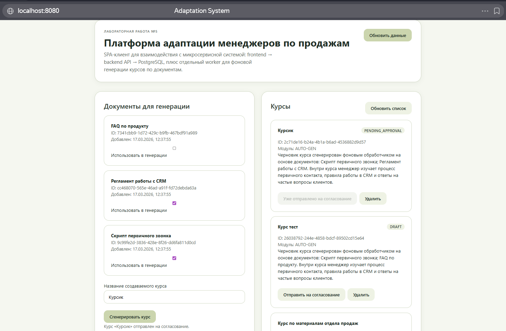

# Лабораторная работа №5

**Тема:** Реализация архитектуры на основе сервисов (микросервисной архитектуры)  
**Цель работы:** Получить опыт организации взаимодействия сервисов с использованием Docker-контейнеров.

## 1. Связь с предыдущими лабораторными работами

Лабораторная работа продолжает архитектурные решения предыдущих лабораторных работ:

- в ЛР2 были выделены контейнеры **SPA-клиент**, **Backend API**, **фоновый обработчик**, **реляционная БД** и внешние интеграции;
- в ЛР3 был детализирован сценарий асинхронной генерации курса по документам через отдельный worker;
- в ЛР4 был спроектирован REST API сервиса управления курсами.

Поэтому в ЛР5 реализована микросервисная конфигурация, которая сохраняет эту логику и переносит её в контейнерную форму.

## 2. Реализованные контейнеры

В работе реализованы 4 контейнера:

1. **frontend** — клиентская часть (SPA-интерфейс на HTML/JS, обслуживается через Nginx);
2. **backend** — серверная часть (FastAPI-сервис с REST API);
3. **db** — база данных PostgreSQL;
4. **worker** — фоновый сервис обработки задач на генерацию курса.

## 4. База данных

В базе данных системы используются три основные таблицы: documents, courses и tasks.

- `documents` — хранит исходные материалы для генерации курса. Основные поля: id, title, content, created_at.
- `courses` — содержит сведения о курсах. Основные поля: id, title, module_id, description, created_by, tags, status, created_at, updated_at.
- `tasks` — предназначена для хранения фоновых задач генерации курса. Основные поля: id, type, status, payload, result, error, created_at, updated_at.

## 5. Взаимодействие сервисов

- пользователь открывает `frontend`;
- `frontend` отправляет HTTP-запросы в `backend`;
- `backend` хранит данные о курсах, документах и задачах в `PostgreSQL`;
- `worker` опрашивает таблицу задач, получает задачи генерации и создаёт новый черновик курса;
- обновлённые данные затем доступны через `backend` и отображаются на `frontend`.

## 5. Реализованная функциональность

### 5.1 Backend API

В серверной части реализован API управления курсами и фоновыми задачами. Сервис предоставляет следующие endpoint'ы:

- `GET /health` — проверка доступности сервиса;
- `GET /api/v1/documents` — получение списка документов;
- `POST /api/v1/courses` — создание курса;
- `GET /api/v1/courses` — получение списка курсов;
- `GET /api/v1/courses/{id}` — получение конкретного курса;
- `PUT /api/v1/courses/{id}` — обновление курса;
- `POST /api/v1/courses/{id}/submit` — отправка курса на согласование;
- `DELETE /api/v1/courses/{id}` — удаление курса;
- `POST /api/v1/courses/generate-from-documents` — создание задачи на генерацию курса;
- `GET /api/v1/tasks/{id}` — получение статуса фоновой задачи.

При запуске приложения серверная часть также выполняет инициализацию базы данных и добавляет стартовые (`seed`) документы, чтобы систему можно было сразу протестировать после развёртывания.

### 5.2 Frontend

Клиентская часть реализована в виде простого веб-интерфейса, доступного по адресу `http://localhost:8080`.

На клиенте реализованы:

- отображение seed-документов;
- запуск генерации курса по документам;
- просмотр списка курсов;
- отправка курса на согласование;
- удаление курса.



### 5.3 Worker

Контейнер `worker` реализует отдельный фоновый сценарий. Он имитирует выполнение длительной операции генерации курса по документам. Логика работы следующая:

1. Находит первую задачу генерации курса в очереди.
2. Переводит её в статус `PROCESSING`.
3. Читает указанные документы из базы данных.
4. На основе этих документов формирует черновик курса.
5. Создаёт новый курс в таблице `courses`.
6. Обновляет задачу, записывая статус `DONE`.

## 6. Docker-конфигурация

В корне проекта создан `docker-compose.yml`, который поднимает:

- `postgres:16-alpine`
- контейнер `backend`
- контейнер `worker`
- контейнер `frontend`

Порты:

- `8080` — frontend
- `8000` — backend
- `5432` — PostgreSQL

Команда запуска:

```bash
docker compose up -d --build
```

Команда остановки:

```bash
docker compose down -v
```

## 7. Непрерывная интеграция (CI)

Для CI создан workflow `.github/workflows/ci.yml`.

Он выполняет следующие шаги:

1. Получает код проекта из репозитория.
2. Поднимает сервисы через Docker Compose.
3. Ожидает доступности backend-сервиса.
4. Устанавливает зависимости для тестов.
5. Запускает интеграционные тесты.
6. В конце завершает работу контейнеров.

Таким образом, после каждого `push` в репозиторий GitHub автоматически проверяет работоспособность приложения.

## 8. Интеграционные тесты

Тесты находятся в `tests/integration/test_api.py`.

Проверяются сценарии:

- проверка доступности backend-сервиса;
- получение списка seed-документов;
- создание курса;
- получение списка курсов;
- обновление курса;
- отправка курса на согласование;
- создание фоновой задачи генерации курса;
- проверка завершения задачи worker'ом;
- получение сгенерированного курса;
- удаление курса;
- негативная проверка получения удалённого курса (`404`).

## 9. Непрерывное развертывание (CD)

Для повышенной сложности создан workflow `.github/workflows/cd.yml`.

Он запускается:

- вручную через `workflow_dispatch`;
- автоматически при `push` в основную ветку;
- автоматически при публикации тега версии.

Workflow выполняет следующие действия:

1. Получает код проекта из репозитория.
2. Выполняет вход в Docker Hub с использованием секретов.
3. Собирает Docker-образы `backend`, `frontend`, `worker`.
4. Публикует их в Docker Hub.

Для работы были добавлены GitHub secrets:

- `DOCKERHUB_USERNAME`
- `DOCKERHUB_TOKEN`
