# Лабораторная работа №6

**Тема:** Использование шаблонов проектирования  
**Цель работы:** Получить опыт применения шаблонов проектирования при написании кода программной системы.

## 1. Исходные данные и связь с ЛР5

В качестве основы для лабораторной работы №6 использована реализованная в ЛР5 микросервисная система управления курсами адаптации менеджеров по продажам. В проекте уже были выделены контейнеры `frontend`, `backend`, `worker` и `db`, а также реализованы основные сценарии:

- создание курса;
- обновление курса;
- отправка курса на согласование;
- постановка фоновой задачи на генерацию курса по документам;
- асинхронная обработка задачи через `worker`.

Цель доработки состояла в том, чтобы **не переписать проект заново**, а развить уже существующую архитектуру и встроить в неё шаблоны GoF и решения GRASP. В результате система сохранила прежний API и сценарии ЛР5, но получила более чистую структуру, лучшее разделение ответственности и расширяемость.

## 2. Карта внедрённых решений

### 2.1 GoF

| Группа        | Шаблон          | Где реализован                                            | Назначение в проекте                                |
| ------------- | --------------- | --------------------------------------------------------- | --------------------------------------------------- |
| Порождающий   | Singleton       | `backend/app/config.py`                                   | единая конфигурация backend-сервиса                 |
| Порождающий   | Builder         | `worker/app/builders.py`                                  | пошаговая сборка сгенерированного курса             |
| Порождающий   | Factory Method  | `worker/app/processors.py`, `backend/app/repositories.py` | создание обработчика задачи и репозиториев          |
| Структурный   | Facade          | `backend/app/facade.py`                                   | единая точка входа в бизнес-логику backend          |
| Структурный   | Adapter         | `worker/app/adapters.py`                                  | адаптация `Document` к формату генерации курса      |
| Структурный   | Decorator       | `backend/app/repositories.py`                             | добавление логирования к репозиторию курсов         |
| Структурный   | Proxy           | `backend/app/repositories.py`                             | кэширование обращений к документам                  |
| Поведенческий | Strategy        | `worker/app/strategies.py`                                | разные алгоритмы построения описания курса          |
| Поведенческий | Observer        | `backend/app/events.py`                                   | реакция на события создания и согласования курса    |
| Поведенческий | Command         | `backend/app/commands.py`                                 | инкапсуляция операций create/update/submit/generate |
| Поведенческий | Template Method | `worker/app/processors.py`                                | общий алгоритм обработки фоновых задач              |
| Поведенческий | State           | `backend/app/state.py`                                    | управление переходами статусов курса                |

### 2.2 GRASP

| Категория             | Решение                                                                |
| --------------------- | ---------------------------------------------------------------------- |
| 5 ролей классов       | Controller, Creator, Information Expert, Pure Fabrication, Indirection |
| 3 принципа разработки | Low Coupling, High Cohesion, Polymorphism                              |
| 1 свойство программы  | Protected Variations                                                   |

---

# Шаблоны проектирования GoF

## 3. Порождающие шаблоны

### 3.1 Singleton — `AppConfig`

**Общее назначение.** Шаблон Singleton гарантирует наличие единственного экземпляра класса и предоставляет глобальную точку доступа к нему.

**Назначение в проекте.** В backend используется единый объект конфигурации `AppConfig`, из которого читаются имя сервиса, версия и режим генерации по умолчанию. Это устраняет дублирование настроек и делает использование конфигурации явным.

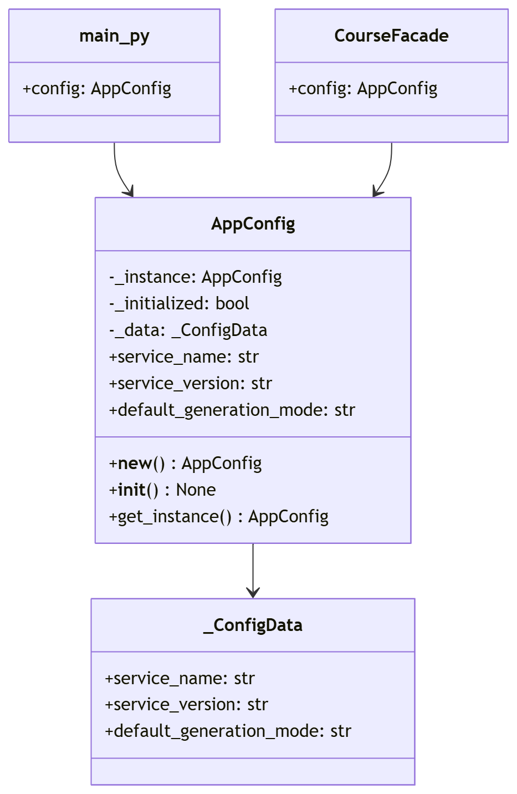

**Фрагмент кода** (`backend/app/config.py`, `backend/app/main.py`, `backend/app/facade.py`):

```python
@dataclass(slots=True)
class _ConfigData:
    service_name: str
    service_version: str
    default_generation_mode: str


class AppConfig:
    _instance: AppConfig | None = None

    def __new__(cls) -> "AppConfig":
        if cls._instance is None:
            cls._instance = super().__new__(cls)
            cls._instance._initialized = False
        return cls._instance

    def __init__(self) -> None:
        if self._initialized:
            return
        self._data = _ConfigData(
            service_name=os.getenv("SERVICE_NAME", "courses-service"),
            service_version=os.getenv("SERVICE_VERSION", "2.0.0"),
            default_generation_mode=os.getenv("DEFAULT_GENERATION_MODE", "summary"),
        )
        self._initialized = True

    @classmethod
    def get_instance(cls) -> "AppConfig":
        return cls()


config = AppConfig.get_instance()
app = FastAPI(title="Adaptation System - Courses Service", version=config.service_version)


class CourseFacade:
    def __post_init__(self) -> None:
        self.config = AppConfig.get_instance()
```

**Практический эффект.** Один и тот же объект используется в `main.py` и `facade.py`, поэтому конфигурация читается централизованно и не размножается по коду. При изменении параметров сервиса не нужно вносить правки в несколько мест.

---

### 3.2 Builder — `GeneratedCourseBuilder`

**Общее назначение.** Builder позволяет пошагово конструировать сложный объект, отделяя процесс сборки от конечного представления.

**Назначение в проекте.** Во `worker` при обработке задачи курс создаётся не одним длинным конструктором, а через `GeneratedCourseBuilder`: сначала задаются заголовок, описание и теги, после чего вызывается `build()`.

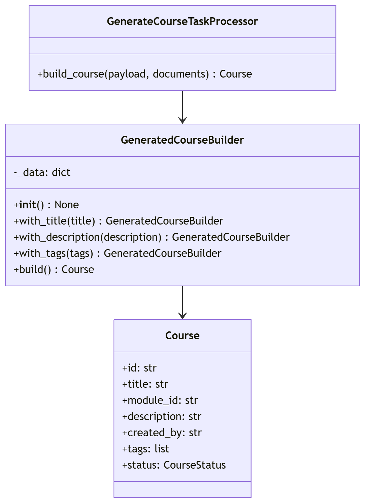

**Фрагмент кода** (`worker/app/builders.py`, `worker/app/processors.py`):

```python
class GeneratedCourseBuilder:
    def __init__(self) -> None:
        self._data: dict = {
            "id": str(uuid.uuid4()),
            "module_id": "AUTO-GEN",
            "created_by": "worker-service",
            "tags": ["generated", "sales", "adaptation"],
            "status": CourseStatus.DRAFT,
        }

    def with_title(self, title: str) -> "GeneratedCourseBuilder":
        self._data["title"] = title
        return self

    def with_description(self, description: str) -> "GeneratedCourseBuilder":
        self._data["description"] = description
        return self

    def with_tags(self, tags: list[str]) -> "GeneratedCourseBuilder":
        self._data["tags"] = tags
        return self

    def build(self) -> Course:
        now = datetime.now(timezone.utc)
        return Course(
            id=self._data["id"],
            title=self._data["title"],
            module_id=self._data["module_id"],
            description=self._data["description"],
            created_by=self._data["created_by"],
            tags=self._data["tags"],
            status=self._data["status"],
            created_at=now,
            updated_at=now,
        )


return (
    GeneratedCourseBuilder()
    .with_title(payload["title"])
    .with_description(description)
    .with_tags(tags)
    .build()
)
```

**Практический эффект.** Логика формирования курса стала более читаемой, а добавление новых шагов сборки, например автора генерации или дополнительных тегов, не требует менять весь код создания объекта.

---

### 3.3 Factory Method — `TaskProcessorFactory`, `RepositoryFactory`

**Общее назначение.** Factory Method инкапсулирует создание объектов, позволяя выбирать конкретный класс во время выполнения.

**Назначение в проекте.** `worker` получает задачу из очереди и через `TaskProcessorFactory` выбирает подходящий обработчик. Сейчас реализован `GenerateCourseTaskProcessor`, но архитектура сразу допускает добавление новых видов задач без изменения основного цикла `worker`. В backend аналогичный приём используется в `RepositoryFactory` для создания репозиториев.

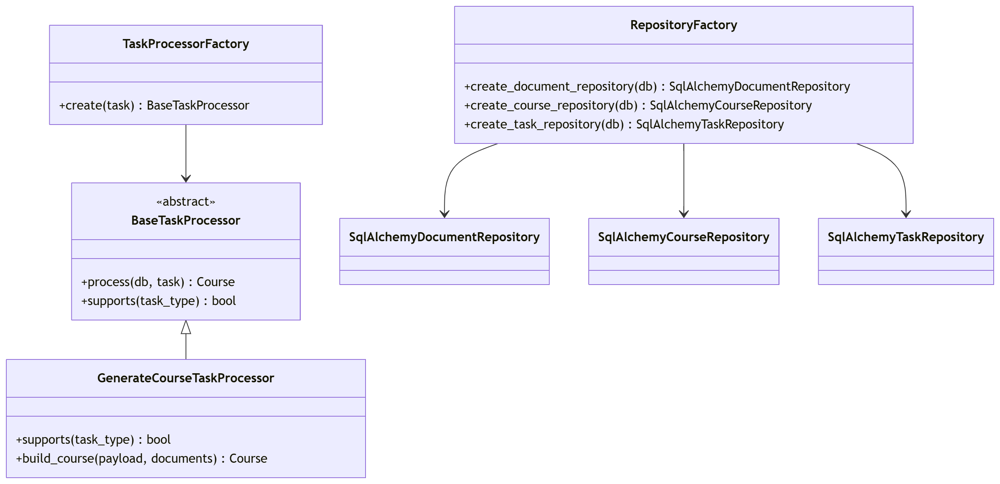

**Фрагмент кода** (`worker/app/processors.py`, `backend/app/repositories.py`):

```python
class TaskProcessorFactory:
    def create(self, task: Task) -> BaseTaskProcessor:
        candidates: list[BaseTaskProcessor] = [GenerateCourseTaskProcessor()]
        for candidate in candidates:
            if candidate.supports(task.type):
                return candidate
        raise ValueError(f"No processor for task type {task.type.value}")


@dataclass(slots=True)
class RepositoryFactory:
    def create_document_repository(self, db: Session) -> SqlAlchemyDocumentRepository:
        return SqlAlchemyDocumentRepository(db)

    def create_course_repository(self, db: Session) -> SqlAlchemyCourseRepository:
        return SqlAlchemyCourseRepository(db)

    def create_task_repository(self, db: Session) -> SqlAlchemyTaskRepository:
        return SqlAlchemyTaskRepository(db)
```

**Практический эффект.** Код `worker.py` и `facade.py` не зависит от конкретных классов обработчиков и репозиториев и остаётся стабильным при расширении системы.

---

## 4. Структурные шаблоны

### 4.1 Facade — `CourseFacade`

**Общее назначение.** Facade предоставляет упрощённый интерфейс к сложной подсистеме.

**Назначение в проекте.** `CourseFacade` скрывает от endpoint’ов детали работы с командами, состояниями, репозиториями, событиями и кэшированием. API-методы обращаются к фасаду, а не собирают бизнес-логику внутри контроллеров.

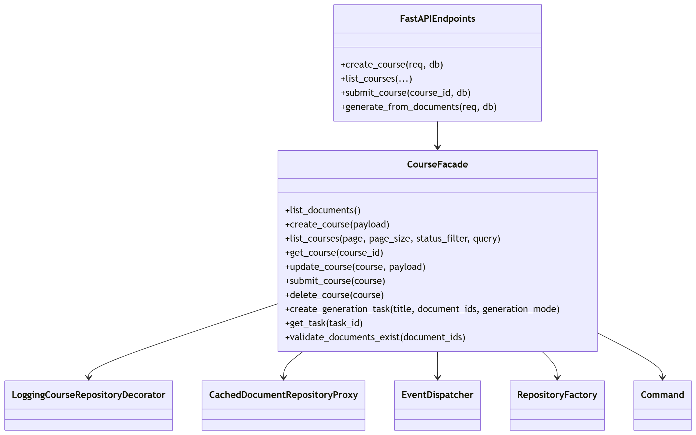

**Фрагмент кода** (`backend/app/facade.py`, `backend/app/main.py`):

```python
@dataclass
class CourseFacade:
    db: Session

    def __post_init__(self) -> None:
        self.config = AppConfig.get_instance()
        self.dispatcher = build_default_dispatcher()
        self.factory = RepositoryFactory()
        self.document_repository = CachedDocumentRepositoryProxy(
            self.factory.create_document_repository(self.db)
        )
        self.course_repository = LoggingCourseRepositoryDecorator(
            self.factory.create_course_repository(self.db)
        )
        self.task_repository = self.factory.create_task_repository(self.db)

    def create_course(self, payload: dict):
        return CreateCourseCommand(
            repository=self.course_repository,
            dispatcher=self.dispatcher,
            payload=payload,
        ).execute()

    def submit_course(self, course):
        return SubmitCourseCommand(
            repository=self.course_repository,
            dispatcher=self.dispatcher,
            course=course,
        ).execute()


@app.post("/api/v1/courses", response_model=CourseResponse, status_code=status.HTTP_201_CREATED)
def create_course(req: CourseCreateRequest, db: Session = Depends(get_db)) -> CourseResponse:
    facade = CourseFacade(db)
    course = facade.create_course(req.model_dump())
    return to_course_response(course)
```

**Практический эффект.** Endpoint’ы в `main.py` стали короче, а бизнес-логика сконцентрирована в одном месте. HTTP-слой отвечает только за приём запроса, проверку данных и возврат ответа.

---

### 4.2 Adapter — `DocumentContentAdapter`

**Общее назначение.** Adapter преобразует интерфейс одного класса в интерфейс, ожидаемый клиентом.

**Назначение в проекте.** Модель `Document` хранится в виде сущности БД, но стратегии генерации курса работают не с ORM-объектом, а с нормализованным фрагментом текста. Адаптер преобразует документ в `DocumentFragment`.

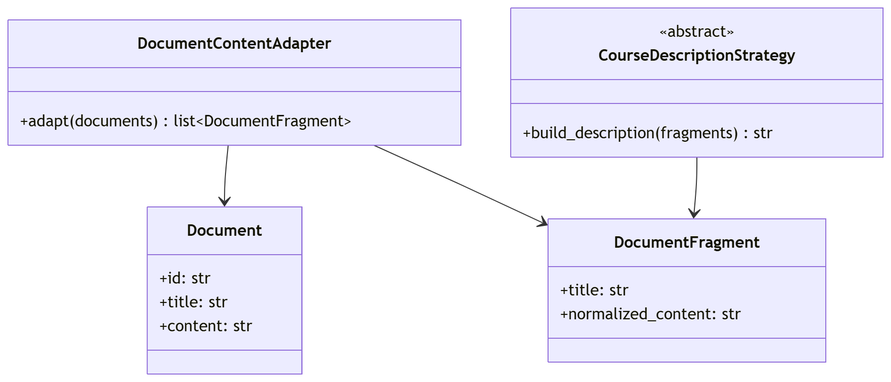

**Фрагмент кода** (`worker/app/adapters.py`, `worker/app/processors.py`):

```python
@dataclass(slots=True)
class DocumentFragment:
    title: str
    normalized_content: str


class DocumentContentAdapter:
    def adapt(self, documents: list[Document]) -> list[DocumentFragment]:
        return [
            DocumentFragment(
                title=document.title,
                normalized_content=" ".join(document.content.replace("\n", " ").split()),
            )
            for document in documents
        ]


class GenerateCourseTaskProcessor(BaseTaskProcessor):
    def build_course(self, payload: dict, documents: list[Document]) -> Course:
        fragments = self.adapter.adapt(documents)
        strategy = self.strategy_resolver.resolve(payload.get("generationMode"))
        description = strategy.build_description(fragments)
        ...
```

**Практический эффект.** Генератор курса не зависит от структуры ORM-модели и может работать с унифицированными входными данными. Если формат хранения документов изменится, корректировки будут локализованы в адаптере.

---

### 4.3 Decorator — `LoggingCourseRepositoryDecorator`

**Общее назначение.** Decorator динамически добавляет объекту новую функциональность без изменения его исходного класса.

**Назначение в проекте.** В backend логирование операций с курсами добавляется не внутрь `SqlAlchemyCourseRepository`, а внешним декоратором. Таким образом базовый репозиторий отвечает только за доступ к данным.

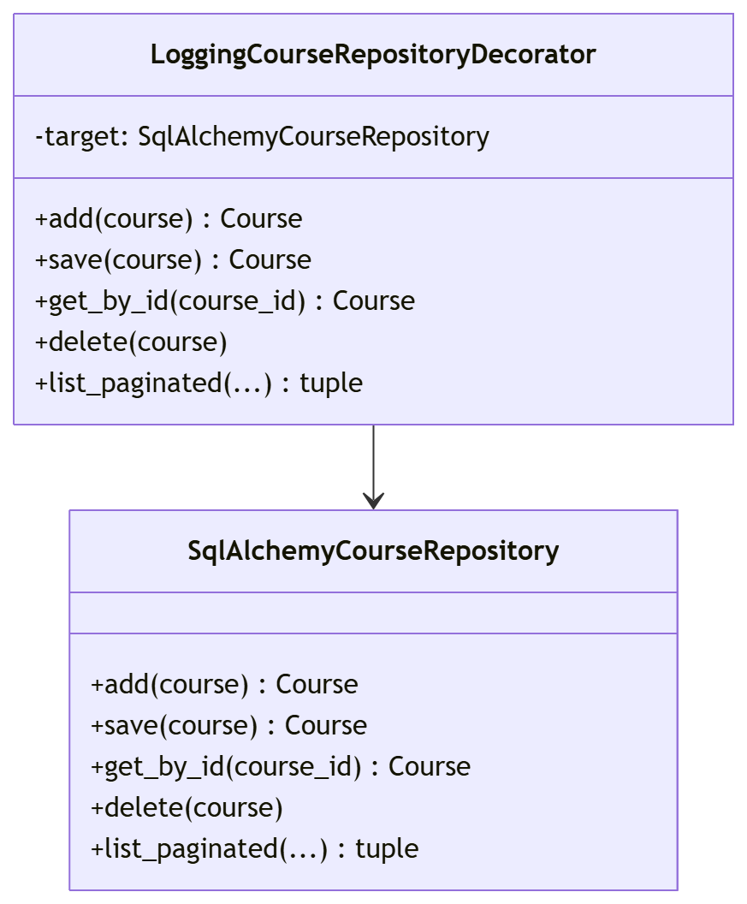

**Фрагмент кода** (`backend/app/repositories.py`, `backend/app/facade.py`):

```python
class LoggingCourseRepositoryDecorator:
    def __init__(self, target: SqlAlchemyCourseRepository) -> None:
        self.target = target

    def add(self, course: Course) -> Course:
        print(f"[COURSE-REPO] create course '{course.title}'")
        return self.target.add(course)

    def save(self, course: Course) -> Course:
        print(f"[COURSE-REPO] save course '{course.id}' with status {course.status.value}")
        return self.target.save(course)

    def get_by_id(self, course_id: str) -> Course | None:
        return self.target.get_by_id(course_id)


self.course_repository = LoggingCourseRepositoryDecorator(
    self.factory.create_course_repository(self.db)
)
```

**Практический эффект.** Нефункциональное поведение, то есть логирование, отделено от основной логики доступа к данным.

---

### 4.4 Proxy — `CachedDocumentRepositoryProxy`

**Общее назначение.** Proxy подставляет объект-заместитель, который контролирует доступ к реальному объекту.

**Назначение в проекте.** При генерации курса backend несколько раз обращается к документам: сначала для проверки существования, затем для чтения. `CachedDocumentRepositoryProxy` сохраняет результаты запросов внутри одного жизненного цикла фасада.

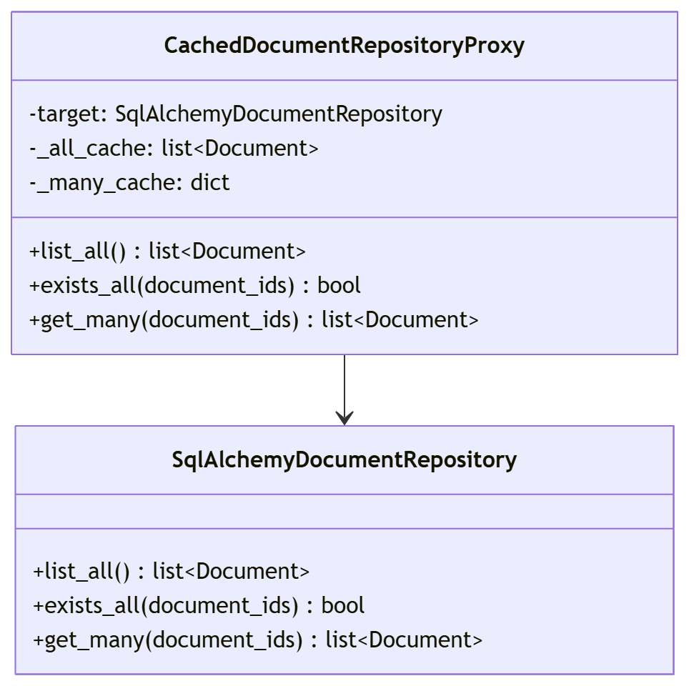

**Фрагмент кода** (`backend/app/repositories.py`):

```python
class CachedDocumentRepositoryProxy:
    def __init__(self, target: SqlAlchemyDocumentRepository) -> None:
        self.target = target
        self._all_cache: list[Document] | None = None
        self._many_cache: dict[tuple[str, ...], list[Document]] = {}

    def list_all(self) -> list[Document]:
        if self._all_cache is None:
            self._all_cache = self.target.list_all()
        return self._all_cache

    def exists_all(self, document_ids: list[str]) -> bool:
        return self.target.exists_all(document_ids)

    def get_many(self, document_ids: list[str]) -> list[Document]:
        key = tuple(sorted(document_ids))
        if key not in self._many_cache:
            self._many_cache[key] = self.target.get_many(document_ids)
        return self._many_cache[key]
```

**Практический эффект.** Сокращается количество одинаковых запросов и улучшается управляемость доступа к документам. При этом основной репозиторий остаётся простым и отвечает только за фактическое чтение из БД.

---

## 5. Поведенческие шаблоны

### 5.1 Strategy — `CourseDescriptionStrategy`

**Общее назначение.** Strategy позволяет определить семейство взаимозаменяемых алгоритмов и подставлять нужный во время выполнения.

**Назначение в проекте.** Во `worker` описание курса может строиться по-разному: кратким резюме (`SummaryDescriptionStrategy`) или в виде структуры курса (`OutlineDescriptionStrategy`). Выбор стратегии зависит от `generationMode` в payload задачи.

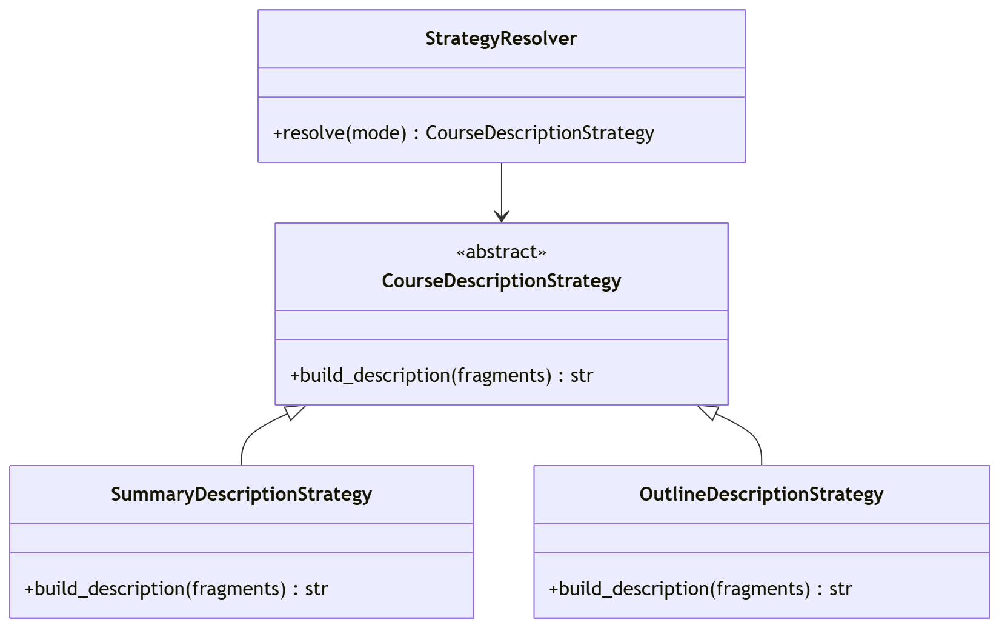

**Фрагмент кода** (`worker/app/strategies.py`, `worker/app/processors.py`):

```python
class SummaryDescriptionStrategy(CourseDescriptionStrategy):
    def build_description(self, fragments: list[DocumentFragment]) -> str:
        topics = "; ".join(fragment.title for fragment in fragments)
        return (
            "Черновик курса сгенерирован на основе документов: "
            f"{topics}. Курс концентрируется на первичном контакте с клиентом, работе в CRM и обработке типовых возражений."
        )


class OutlineDescriptionStrategy(CourseDescriptionStrategy):
    def build_description(self, fragments: list[DocumentFragment]) -> str:
        lines = ["Сгенерированная структура курса:"]
        for index, fragment in enumerate(fragments, start=1):
            preview = fragment.normalized_content[:90]
            lines.append(f"{index}. {fragment.title}: {preview}...")
        return " ".join(lines)


class StrategyResolver:
    def resolve(self, mode: str | None) -> CourseDescriptionStrategy:
        if (mode or "summary").lower() == "outline":
            return OutlineDescriptionStrategy()
        return SummaryDescriptionStrategy()


strategy = self.strategy_resolver.resolve(payload.get("generationMode"))
description = strategy.build_description(fragments)
```

**Практический эффект.** Добавление нового алгоритма генерации не требует переписывать `worker`, достаточно добавить новую стратегию и правило её выбора.

---

### 5.2 Observer — `EventDispatcher`

**Общее назначение.** Observer определяет зависимость «один ко многим»: при изменении состояния объекта все подписчики получают уведомление.

**Назначение в проекте.** После создания курса, его обновления, отправки на согласование и постановки фоновой задачи публикуются доменные события. На них реагируют слушатели аудита, метрик и уведомлений.

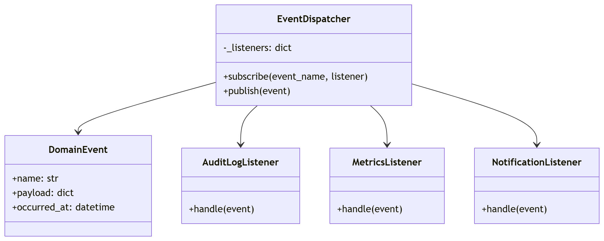

**Фрагмент кода** (`backend/app/events.py`, `backend/app/commands.py`):

```python
@dataclass(slots=True)
class DomainEvent:
    name: str
    payload: dict
    occurred_at: datetime = field(default_factory=lambda: datetime.now(timezone.utc))


class EventDispatcher:
    def __init__(self) -> None:
        self._listeners: dict[str, list[EventListener]] = {}

    def subscribe(self, event_name: str, listener: EventListener) -> None:
        self._listeners.setdefault(event_name, []).append(listener)

    def publish(self, event: DomainEvent) -> None:
        for listener in self._listeners.get(event.name, []):
            listener.handle(event)


self.dispatcher.publish(
    DomainEvent(name="course_submitted", payload={"courseId": saved.id, "status": saved.status.value})
)
```

**Практический эффект.** Бизнес-операции не зависят напрямую от логирования и уведомлений: они просто публикуют событие. Благодаря этому инфраструктурные реакции можно расширять без изменения самих команд.

---

### 5.3 Command — `CreateCourseCommand`, `UpdateCourseCommand`, `SubmitCourseCommand`, `CreateGenerationTaskCommand`

**Общее назначение.** Command превращает запрос в самостоятельный объект, который можно передавать, хранить и выполнять.

**Назначение в проекте.** Основные действия backend инкапсулированы в объектах-командах. `CourseFacade` выступает инициатором, а команды исполняют конкретную операцию.

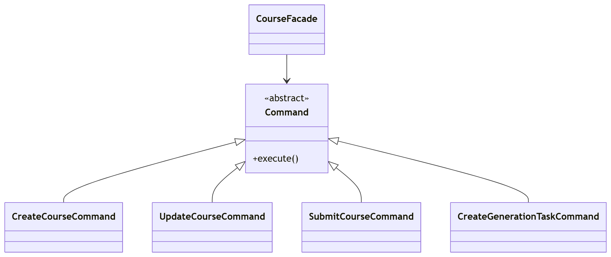

**Фрагмент кода** (`backend/app/commands.py`, `backend/app/facade.py`):

```python
class CreateCourseCommand(Command):
    def __init__(self, *, repository, dispatcher: EventDispatcher, payload: dict) -> None:
        self.repository = repository
        self.dispatcher = dispatcher
        self.payload = payload

    def execute(self) -> Course:
        course = Course(
            id=str(uuid4()),
            title=self.payload["title"],
            module_id=self.payload["moduleId"],
            description=self.payload.get("description"),
            created_by=self.payload["createdBy"],
            tags=self.payload.get("tags", []),
            status=CourseStatus.DRAFT,
        )
        created = self.repository.add(course)
        self.dispatcher.publish(DomainEvent(name="course_created", payload={"courseId": created.id}))
        return created


class SubmitCourseCommand(Command):
    def execute(self) -> Course:
        current_state = CourseStateResolver.resolve(self.course.status)
        updated_course = current_state.submit(self.course)
        saved = self.repository.save(updated_course)
        self.dispatcher.publish(
            DomainEvent(name="course_submitted", payload={"courseId": saved.id, "status": saved.status.value})
        )
        return saved


return SubmitCourseCommand(
    repository=self.course_repository,
    dispatcher=self.dispatcher,
    course=course,
).execute()
```

**Практический эффект.** Операции стали независимыми и хорошо изолированными, что удобно для тестирования, чтения и дальнейшего расширения backend-логики.

---

### 5.4 Template Method — `BaseTaskProcessor`

**Общее назначение.** Template Method задаёт каркас алгоритма, оставляя отдельные шаги переопределяемыми в подклассах.

**Назначение в проекте.** Обработка фоновых задач в `worker` всегда проходит по одной схеме: отметить задачу как выполняемую, прочитать payload, загрузить документы, построить курс, сохранить его, завершить задачу. Этот каркас закреплён в `BaseTaskProcessor`.

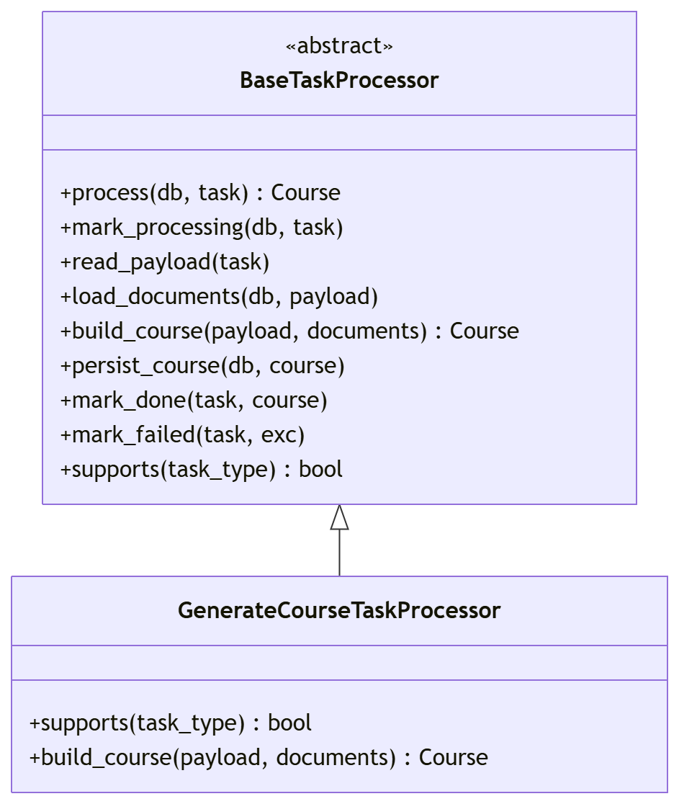

**Фрагмент кода** (`worker/app/processors.py`, `worker/app/worker.py`):

```python
class BaseTaskProcessor(ABC):
    def __init__(self) -> None:
        self.adapter = DocumentContentAdapter()
        self.strategy_resolver = StrategyResolver()

    def process(self, db: Session, task: Task) -> Course:
        self.mark_processing(db, task)
        payload = self.read_payload(task)
        documents = self.load_documents(db, payload)
        course = self.build_course(payload, documents)
        self.persist_course(db, course)
        self.mark_done(task, course)
        return course

    @abstractmethod
    def supports(self, task_type: TaskType) -> bool: ...

    @abstractmethod
    def build_course(self, payload: dict, documents: list[Document]) -> Course: ...


processor = TaskProcessorFactory().create(task)
try:
    processor.process(db, task)
except Exception as exc:
    processor.mark_failed(task, exc)
```

**Практический эффект.** Алгоритм работы `worker` стандартизирован, а изменяемой остаётся только специфика конкретного типа задачи. Это снижает вероятность дублирования одинаковых шагов в разных обработчиках.

---

### 5.5 State — `CourseWorkflowState`

**Общее назначение.** State позволяет менять поведение объекта при изменении его внутреннего состояния.

**Назначение в проекте.** Отправка курса на согласование зависит от его текущего статуса. Если курс находится в состоянии `DRAFT`, разрешён переход в `PENDING_APPROVAL`; для других состояний операция запрещена.

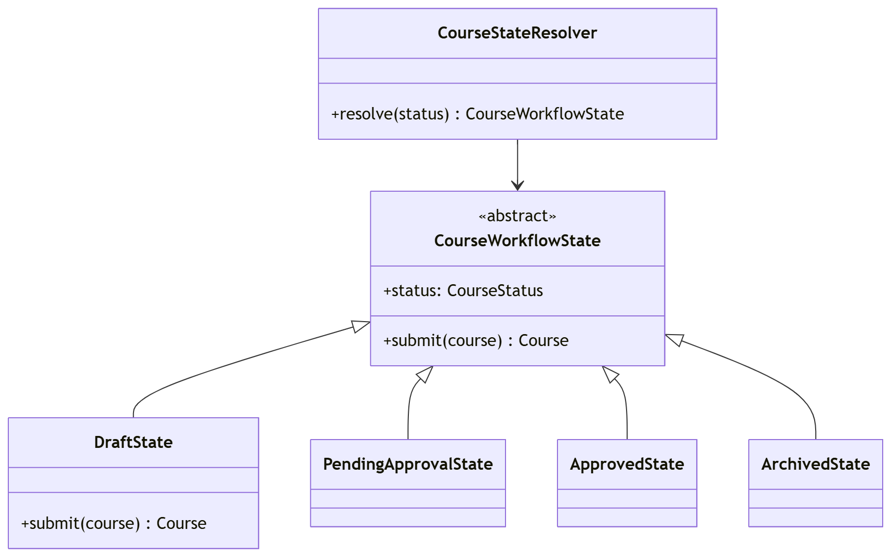

**Фрагмент кода** (`backend/app/state.py`, `backend/app/commands.py`):

```python
class CourseWorkflowState(ABC):
    status: CourseStatus

    def submit(self, course: Course) -> Course:
        raise ValueError(f"Transition from {self.status.value} by submit() is not allowed")


class DraftState(CourseWorkflowState):
    status = CourseStatus.DRAFT

    def submit(self, course: Course) -> Course:
        course.status = CourseStatus.PENDING_APPROVAL
        return course


class CourseStateResolver:
    @staticmethod
    def resolve(status: CourseStatus) -> CourseWorkflowState:
        return _STATE_MAP[status]


current_state = CourseStateResolver.resolve(self.course.status)
updated_course = current_state.submit(self.course)
```

**Практический эффект.** Правила переходов между статусами отделены от endpoint’ов и команд, а расширение жизненного цикла курса выполняется без усложнения контроллеров.

---

# Шаблоны проектирования GRASP

## 6. Роли (обязанности) классов

### 6.1 Controller — `CourseFacade`

**Проблема.** Если endpoint’ы напрямую управляют репозиториями, состояниями, командами и событиями, то контроллеры быстро становятся перегруженными.

**Решение.** Роль контроллера передана классу `CourseFacade`, который принимает запросы от API и координирует выполнение операций.

**Фрагмент кода.**

```python
facade = CourseFacade(db)
course = facade.create_course(req.model_dump())
```

**Результаты, которые достигаются.** В `main.py` остаётся только HTTP-уровень, а прикладная логика перемещается в отдельный координирующий объект.

**Связь с другими паттернами.** Facade, Command, Observer.

---

### 6.2 Creator — `CreateCourseCommand`, `GeneratedCourseBuilder`, `CreateGenerationTaskCommand`

**Проблема.** Нужно определить, какой класс должен отвечать за создание объектов `Course` и `Task`.

**Решение.** Создание курса вручную поручено `CreateCourseCommand`, создание курса из фоновой генерации — `GeneratedCourseBuilder`, а создание фоновой задачи — `CreateGenerationTaskCommand`, так как именно эти классы располагают полным набором исходных данных.

**Фрагмент кода.**

```python
course = Course(
    id=str(uuid4()),
    title=self.payload["title"],
    module_id=self.payload["moduleId"],
    description=self.payload.get("description"),
    created_by=self.payload["createdBy"],
    tags=self.payload.get("tags", []),
    status=CourseStatus.DRAFT,
)


task = Task(
    id=str(uuid4()),
    type=TaskType.GENERATE_COURSE,
    status=TaskStatus.QUEUED,
    payload={"title": self.title, "documentIds": self.document_ids, "generationMode": self.generation_mode},
)
```

**Результаты, которые достигаются.** Логика создания не размазана по контроллерам и процессорам, а находится там, где есть все необходимые параметры.

**Связь с другими паттернами.** Builder, Command.

---

### 6.3 Information Expert — `CourseStateResolver`, репозитории

**Проблема.** Кто должен знать правила переходов статусов и способы получения данных из БД?

**Решение.** За переходы отвечает `CourseStateResolver` вместе с конкретными состояниями, а за извлечение данных отвечают репозитории `SqlAlchemyCourseRepository`, `SqlAlchemyDocumentRepository`, `SqlAlchemyTaskRepository`.

**Фрагмент кода.**

```python
current_state = CourseStateResolver.resolve(self.course.status)
updated_course = current_state.submit(self.course)


existing = self.db.scalars(select(Document.id).where(Document.id.in_(document_ids))).all()
return len(existing) == len(document_ids)
```

**Результаты, которые достигаются.** Решения принимаются там, где действительно сосредоточено знание о предметной области или источнике данных.

**Связь с другими паттернами.** State, Proxy, Decorator.

---

### 6.4 Pure Fabrication — `EventDispatcher`, декораторы и прокси

**Проблема.** Не все полезные классы естественно принадлежат предметной области, но без них структура быстро становится хаотичной.

**Решение.** Введены искусственные, но полезные классы инфраструктурного уровня: `EventDispatcher`, `LoggingCourseRepositoryDecorator`, `CachedDocumentRepositoryProxy`.

**Фрагмент кода.**

```python
self.document_repository = CachedDocumentRepositoryProxy(...)
self.course_repository = LoggingCourseRepositoryDecorator(...)
self.dispatcher = build_default_dispatcher()
```

**Результаты, которые достигаются.** Предметные сущности `Course`, `Task`, `Document` не перегружаются техническими обязанностями.

**Связь с другими паттернами.** Observer, Decorator, Proxy.

---

### 6.5 Indirection — `EventDispatcher`

**Проблема.** Нельзя жёстко связывать бизнес-операции с аудитом, метриками и уведомлениями, иначе любое изменение инфраструктуры затронет прикладную логику.

**Решение.** Между источником события и обработчиками введён посредник — `EventDispatcher`.

**Фрагмент кода.**

```python
self.dispatcher.publish(DomainEvent(name="course_submitted", payload={...}))
```

**Результаты, которые достигаются.** Команды знают только о публикации события, но не зависят от числа и состава слушателей.

**Связь с другими паттернами.** Observer, Facade.

---

## 7. Принципы разработки

### 7.1 Low Coupling

**Проблема.** При высокой связанности изменение одного класса заставляет переписывать множество других.

**Решение.** В проекте контроллеры общаются с фасадом, фасад — с командами и репозиториями, `worker` — с фабрикой обработчиков и стратегиями. Прямые связи между уровнями минимизированы.

**Фрагмент кода.**

```python
processor = TaskProcessorFactory().create(task)
processor.process(db, task)
```

**Результаты, которые достигаются.** Добавление новых типов задач и стратегий не ломает основной цикл обработки.

**Связь с другими паттернами.** Factory Method, Strategy, Facade.

---

### 7.2 High Cohesion

**Проблема.** Когда один класс делает слишком много, его становится сложно читать, тестировать и расширять.

**Решение.** Обязанности разделены: команды отвечают за конкретные операции, репозитории — за доступ к данным, стратегии — за алгоритмы генерации, состояния — за переходы статусов.

**Фрагмент кода.**

```python
class SummaryDescriptionStrategy(CourseDescriptionStrategy):
    def build_description(self, fragments: list[DocumentFragment]) -> str:
        ...
```

**Результаты, которые достигаются.** Каждый класс имеет узкую и понятную ответственность.

**Связь с другими паттернами.** Strategy, State, Command.

---

### 7.3 Polymorphism

**Проблема.** Ветвления `if/else` по типам объектов со временем разрастаются и усложняют код.

**Решение.** Поведение вынесено в иерархии: стратегии генерации, состояния курса, обработчики задач.

**Фрагмент кода.**

```python
class CourseDescriptionStrategy(ABC):
    @abstractmethod
    def build_description(self, fragments: list[DocumentFragment]) -> str: ...
```

**Результаты, которые достигаются.** Новое поведение добавляется через новый класс, а не через переписывание существующих условий.

**Связь с другими паттернами.** Strategy, State, Template Method.

---

## 8. Свойство программы (цель)

### 8.1 Protected Variations

**Проблема.** В системе заранее известны точки будущих изменений: новые типы фоновых задач, новые режимы генерации курса, новые реакции на доменные события.

**Решение.** Эти точки изолированы за устойчивыми интерфейсами и абстракциями: `BaseTaskProcessor`, `CourseDescriptionStrategy`, `CourseWorkflowState`, `EventDispatcher`.

**Фрагмент кода.**

```python
class BaseTaskProcessor(ABC):
    @abstractmethod
    def supports(self, task_type: TaskType) -> bool: ...

    @abstractmethod
    def build_course(self, payload: dict, documents: list[Document]) -> Course: ...
```

**Результаты, которые достигаются.** Проект лучше защищён от изменений: новые варианты поведения добавляются локально, без каскадной переработки основной архитектуры.

**Связь с другими паттернами.** Template Method, Strategy, State, Factory Method.

---

## 9. Изменения в проекте и результат

В ходе выполнения лабораторной работы были внесены следующие доработки в код ЛР5:

1. Добавлен слой фасада `CourseFacade`, через который backend выполняет прикладные операции.
2. Операции создания, обновления, отправки на согласование и постановки фоновой задачи оформлены как команды.
3. Введён механизм доменных событий и подписчиков.
4. Правила перехода статусов курса вынесены в отдельные состояния.
5. Доступ к данным оформлен через репозитории, дополненные декоратором и прокси.
6. Во `worker` добавлены фабрика обработчиков, шаблонный метод обработки задач, стратегии генерации текста, адаптер документов и builder курса.
7. В API расширен сценарий генерации: теперь задача может содержать `generationMode` (`summary` или `outline`).
8. Добавлен дополнительный интеграционный тест `test_worker_supports_outline_generation_mode`.
