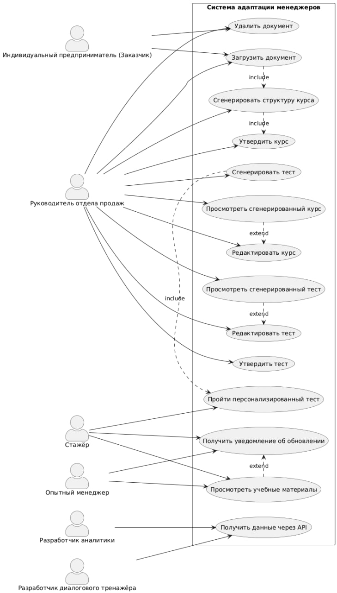

# Лабораторная работа №1

## Тема

Формулирование требований к программной системе

## Цель работы

Научиться анализировать поставленную задачу, формулировать функциональные и нефункциональные требования к проектируемой системе.

## Перечень заинтересованных лиц (стейкхолдеров)

- **ИП — заказчик проекта**  
  Заинтересован в получении рабочего инструмента для адаптации сотрудников продаж и автоматизации обучения.  
  **Цель:** сокращение времени и затрат на онбординг новых менеджеров, повышение качества их подготовки.

- **Руководитель отдела продаж**  
  Администратор системы, ответственный за контроль адаптации стажёров.  
  **Цель:** проверка и утверждение сгенерированных курсов и тестов, мониторинг прогресса команды, коррекция обучающих материалов.

- **Стажёры (новые менеджеры по продажам)**  
  Основные пользователи системы обучения.  
  **Цель:** прохождение утверждённых курсов и персонализированных тестов, получение обратной связи по ошибкам.

- **Опытные менеджеры по продажам**  
  Второстепенные пользователи системы.  
  **Цель:** использование утверждённых материалов как справочника по продукту и регламентам в рабочем процессе.

- **Коллега-разработчик, отвечающий за диалоговый тренажёр и чат-бот**  
  Внутренний стейкхолдер, разработчик смежного модуля.  
  **Цель:** получение доступа к утверждённым курсам, тестам и материалам через API для интеграции с диалоговым тренажёром.

- **Коллега-разработчик, который отвечает за мониторинг, отчёты и аналитику**  
  Внутренний стейкхолдер, разработчик модуля мониторинга и отчётов.  
  **Цель:** получение данных о результатах тестов, истории ошибок и активности пользователей через API для формирования аналитических отчётов.

## Перечень функциональных требований

### Загрузка и удаление документов

- Система должна позволять загружать документы компании (PDF, DOCX, TXT) через веб-интерфейс или API.
- Руководитель должен иметь возможность удалять устаревшие или некорректные документы из системы.

### Обработка документов

- Система должна выполнять парсинг, очистку и разбиение загруженных документов на смысловые блоки.

### Генерация структуры курса

- Система по запросу руководителя должна формировать структуру обучающего курса на основе загруженных материалов с использованием LLM.

### Работа с курсами (редактирование и утверждение)

- Руководитель отдела продаж должен иметь возможность просматривать сгенерированные курсы.
- Руководитель отдела продаж должен иметь возможность редактировать структуру курса, модули и материалы.
- Руководитель отдела продаж должен иметь возможность утверждать курс для публикации стажёрам.

### Генерация тестов

- Система по запросу руководителя должна генерировать тестовые задания, опираясь на созданный курс.

### Персонализация тестов на основе истории ошибок

- Система должна составлять ежедневные контрольные тесты, адаптированные под слабые места каждого стажёра.

### Работа с тестами (проверка и утверждение)

- Руководитель отдела продаж должен иметь возможность просматривать сгенерированные тесты.
- Руководитель отдела продаж должен иметь возможность редактировать вопросы и ответы.
- Руководитель отдела продаж должен иметь возможность утверждать тесты для использования стажёрами.

### Интеграция с модулями других студентов

- Система должна предоставлять API для доступа к утверждённым материалам курсов, тестам и истории ошибок для интеграции с диалоговым тренажёром и модулем аналитики.

### Управление версиями и доступом

- Система должна сохранять историю версий курсов и тестов.
- Стажёры должны иметь доступ только к последней утверждённой версии материалов.

### Уведомления об изменениях

- Система должна уведомлять руководителя о необходимости обновления курсов/тестов при изменении документов.
- Стажёры и опытные менеджеры должны получать уведомления об обновлении учебных материалов.

## Диаграмма вариантов использования

## Перечень сделанных предположений

- Система будет использовать LLM с доступом через API (например, YandexGPT).
- Документы загружаются в форматах PDF, DOCX, TXT.
- Система отслеживает зависимости между документами, курсами и тестами.
- Утверждённые курсы и тесты становятся доступны стажёрам только после одобрения руководителем.
- Система сохраняет историю ошибок каждого стажёра для персонализации последующих тестов.
- При удалении документа система определяет, какие курсы и тесты затрагиваются, и предлагает их обновить.
- Для хранения данных будет использована реляционная БД (например, PostgreSQL).
- Frontend-часть системы будет разрабатываться отдельно и взаимодействовать с backend через REST API.
- Руководитель имеет права администратора в системе, стажёры — права пользователей.

## Перечень нефункциональных требований

### Производительность

- Генерация структуры курса на основе документа до 50 страниц — не более 60 секунд.
- Формирование мини-контрольной (3–5 вопросов) на основе уже подготовленных данных — не более 5 секунд.

### Масштабируемость

- Поддержка одновременной работы не менее 100 активных пользователей, проходящих тесты.
- Возможность вынести операции, связанные с обращением к LLM, в отдельные фоновые сервисы/очереди при росте нагрузки.

### Надёжность и целостность данных

- Потеря данных о попытках тестов недопустима; запись результатов в хранилище должна выполняться до отображения результата пользователю.
- При ошибках в работе LLM система не должна повреждать существующую структуру курсов и тестов.

### Безопасность

- Все обращения к API — по HTTPS, с обязательной аутентификацией.
- Разграничение доступа к документам и данным тестов по ролям; стажёр видит только свои результаты.

### Сопровождаемость и расширяемость

- Логическая структура системы должна быть разбита на модули: загрузка и обработка документов, генерация курсов, генерация тестов, API, подсистема хранения.
- Наличие автоматических тестов для основных сценариев (загрузка документа, генерация курса, прохождение теста), что позволит безопасно вносить изменения и расширения функциональности.

