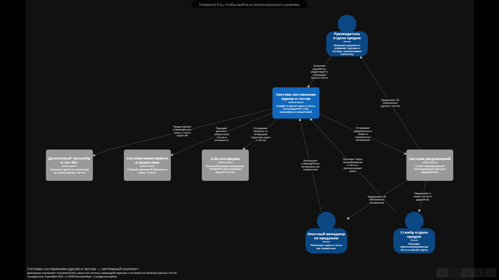
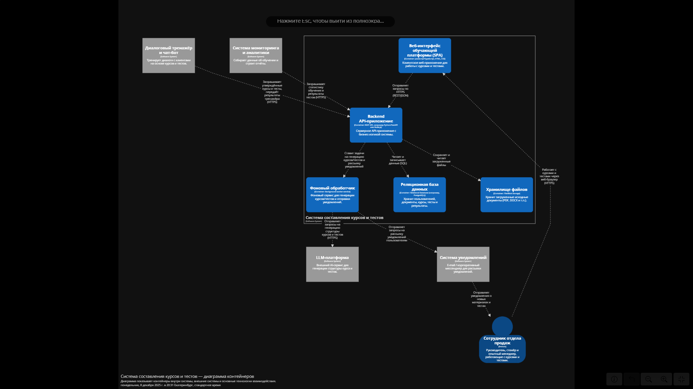
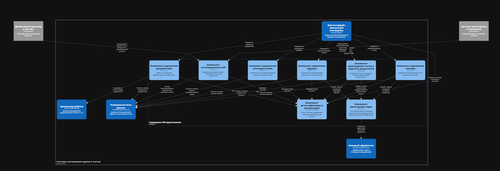
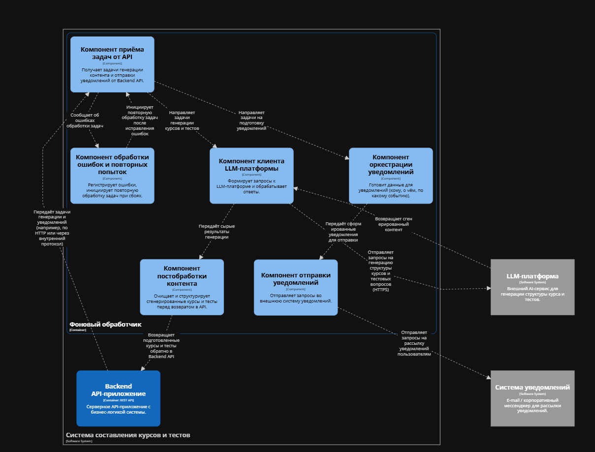

# Лабораторная работа №2

## Тема

Использование нотации C4 model для проектирования архитектуры программной системы

## Цель работы

Получить опыт использования графической нотации для фиксации архитектурных решений.

## Диаграмма системного контекста

На диаграмме системного контекста представлена программная система **«Система составления курсов и тестов»**, которая находится в центре ландшафта и взаимодействует с пользователями и внешними программными системами.

### Основные элементы диаграммы

- **Центральная программная система**  
  **«Система составления курсов и тестов»** — основная система, которая отвечает за:

  - загрузку и хранение исходных документов;
  - создание и редактирование курсов;
  - генерацию и хранение тестов;
  - предоставление данных внешним системам (диалоговый тренажёр, аналитика).

- **Пользователь (Person)**

  - руководителя отдела продаж;
  - стажёра отдела продаж;
  - опытного менеджера по продажам.

  Сотрудник взаимодействует с системой через веб-интерфейс: загружает документы, создаёт и утверждает материалы, проходит тесты и просматривает результаты.

- **Внешние программные системы (Software System)**

  - **«Диалоговый тренажёр и чат-бот»** — использует утверждённые курсы и тесты для тренировки диалогов с клиентами, получает данные через API системы.
  - **«Система мониторинга и аналитики»** — запрашивает статистику обучения (результаты тестов, активность пользователей) для построения отчётов.
  - **«LLM-платформа»** — внешний AI-сервис, к которому система обращается для генерации структуры курсов и тестовых вопросов на основе загруженных документов.
  - **«Система уведомлений»** — e-mail или корпоративный мессенджер, через который пользователям рассылаются уведомления о новых курсах, тестах и изменениях материалов.

Диаграмма системного контекста показывает только участников и основные программные системы, без детализации технологий и внутреннего устройства. Это позволяет увидеть, **кто** и **какие внешние сервисы** взаимодействуют с системой составления курсов и тестов.

## Диаграмма контейнеров

Диаграмма контейнеров детализирует внутреннее устройство системы составления курсов и тестов. Внутри пунктирной рамки показаны контейнеры, из которых состоит система. Внешние программные системы отображены снаружи, как и на диаграмме контекста.

### Основные контейнеры системы

1. **«Веб-интерфейс обучающей платформы (SPA)»**  
   Клиентское веб-приложение, запускаемое в браузере сотрудника отдела продаж. Через него пользователь:

   - загружает документы;
   - просматривает и редактирует курсы и тесты;
   - проходит тесты и просматривает свои результаты.

   Взаимодействует с backend по HTTPS, используя REST/JSON.

2. **«Backend API-приложение»**  
   Серверное API-приложение, в котором сосредоточена основная бизнес-логика:

   - аутентификация и авторизация пользователей;
   - управление документами, курсами и тестами;
   - учёт попыток прохождения тестов и результатов;
   - предоставление API внешним системам (диалоговый тренажёр, аналитика);
   - постановка задач генерации материалов и уведомлений для фонового обработчика.

   Backend взаимодействует с базой данных и хранилищем файлов.

3. **«Фоновый обработчик»**  
   Отдельный сервис, который отвечает за длительные операции:

   - генерация структуры курсов и тестов при помощи LLM-платформы;
   - подготовка и отправка уведомлений через внешнюю систему уведомлений.

   Фоновый обработчик получает задачи от Backend API и вызывает внешние сервисы.

4. **«Реляционная база данных»**  
   Хранит структурированные данные:

   - пользователей и роли;
   - документы и их метаданные;
   - описания курсов и тестов;
   - результаты прохождения тестов и историю изменений.

5. **«Хранилище файлов»**  
   Содержит загруженные исходные документы (PDF, DOCX и т.п.), на которые backend ссылается через метаданные в базе данных.

### Внешние программные системы на диаграмме контейнеров

- **«Диалоговый тренажёр и чат-бот»** — обращается к Backend API, чтобы получать актуальные курсы и тесты, а также передавать результаты тренировки.
- **«Система мониторинга и аналитики»** — запрашивает у Backend API статистику обучения и результаты тестов.
- **«LLM-платформа»** — получает запросы от фонового обработчика и возвращает сгенерированные курсы и тесты.
- **«Система уведомлений»** — по запросу фонового обработчика отправляет уведомления пользователям о новых материалах и тестах.

### Причины выбора базового архитектурного стиля / архитектуры уровня приложений

Для проектируемой системы выбран **клиент–серверный стиль с REST-API и слоистой архитектурой уровня приложений** (presentation → application/business → data) с выделенным контейнером фонового обработчика. Основные причины:

1. **Разделение фронтенда и бэкенда.**  
   Требуется отдельная разработка пользовательского интерфейса и серверной логики. Использование SPA + REST API даёт гибкость: к API могут подключаться не только веб-интерфейс, но и внешние системы (тренажёр, аналитика).

2. **Масштабируемость и тяжёлые операции с LLM.**  
   Генерация курсов и тестов с помощью LLM — длительные и ресурсоёмкие задачи. Выделение фонового обработчика позволяет:

   - не блокировать ответы API;
   - отдельно масштабировать компонент, который работает с LLM и уведомлениями.

3. **Интеграция с внешними системами.**  
   Диалоговый тренажёр и модуль аналитики получают данные по HTTP/HTTPS через REST-API. Наличие чёткого API-слоя упрощает интеграцию и делает систему более расширяемой.

4. **Надёжное хранение данных.**  
   Использование реляционной базы данных и отдельного файлового хранилища обеспечивает:

   - целостность данных;
   - удобную работу с большими файлами;
   - возможность резервного копирования и восстановления.

5. **Сопровождаемость и прозрачное распределение ответственности.**  
   Логика разделена по контейнерам:

   - представление — в веб-интерфейсе,
   - бизнес-логика и API — в серверном приложении,
   - фоновые задачи и интеграции — в фоновом обработчике,
   - данные — в БД и файловом хранилище.

   Это облегчает понимание системы, её развитие и поддержку.

## Диаграмма компонентов

В рамках лабораторной работы были построены две диаграммы компонентов:

1. для контейнера **«Backend API-приложение»**,
2. для контейнера **«Фоновый обработчик»**.

### 1. Диаграмма компонентов контейнера «Backend API-приложение»

Диаграмма показывает внутреннюю структуру серверного API-приложения и распределение ответственности между компонентами.

**Основные компоненты:**

- **Компонент аутентификации и авторизации**  
  Отвечает за:

  - вход и выход пользователей;
  - выдачу и проверку токенов;
  - проверку прав доступа (ролей) при обращении к остальным компонентам.

- **Компонент управления пользователями**  
  Реализует:

  - создание и обновление учётных записей;
  - управление ролями (руководитель, стажёр, опытный менеджер);
  - получение информации о пользователях.

- **Компонент управления документами**  
  Обрабатывает:

  - загрузку документов через веб-интерфейс;
  - хранение и обновление метаданных;
  - связь с хранилищем файлов.

- **Компонент управления курсами**  
  Отвечает за:

  - создание и редактирование структуры курсов;
  - хранение версий курсов;
  - привязку курсов к исходным документам.

- **Компонент управления тестами**  
  Реализует:

  - создание и редактирование тестов;
  - хранение вопросов и вариантов ответов;
  - использование сгенерированных тестовых заданий.

- **Компонент прохождения тестов и подсчёта результатов**  
  Обеспечивает:

  - создание попыток прохождения теста;
  - приём и проверку ответов;
  - вычисление итогового результата и сохранение его в БД.

- **Компонент интеграционного API**  
  Содержит специальные эндпоинты для:

  - диалогового тренажёра (получение курсов, тестов, результатов пользователей);
  - системы аналитики (предоставление агрегированных данных).

- **Компонент оркестрации задач**  
  Отвечает за постановку задач фонового уровня:
  - создание задач генерации структуры курса и тестов;
  - создание задач отправки уведомлений по результатам тестов;
  - передачу этих задач в контейнер **«Фоновый обработчик»**.

Компоненты взаимодействуют между собой и с **реляционной базой данных** и **хранилищем файлов**, обеспечивая полный цикл работы: от загрузки документа и создания курса до прохождения теста и интеграции с внешними сервисами.

### 2. Диаграмма компонентов контейнера «Фоновый обработчик»

Диаграмма компонентов фонового обработчика показывает, как внутри этого контейнера организованы отдельные области ответственности, связанные с генерацией контента и отправкой уведомлений.

**Основные компоненты:**

- **Компонент приёма задач от API**  
  Получает от Backend API задачи:

  - на генерацию структуры курсов и тестов;
  - на отправку уведомлений пользователям.

  Является входной точкой фонового обработчика.

- **Компонент клиента LLM-платформы**  
  Реализует взаимодействие с внешней LLM-платформой:

  - формирует запросы на генерацию курсов и тестов;
  - отправляет запросы и получает ответы;
  - обрабатывает ошибки, связанные с внешним сервисом.

- **Компонент постобработки контента**  
  Обрабатывает ответы LLM:

  - очищает и структурирует сгенерированный текст;
  - приводит курсы и тесты к формату, который ожидает Backend API;
  - при необходимости применяет дополнительные правила (ограничение длины, форматирование и т.п.).

- **Компонент оркестрации уведомлений**  
  Формирует данные для уведомлений:

  - определяет, кому нужно отправить уведомление;
  - определяет событие (новый курс, новый тест, результаты теста);
  - готовит текст сообщения и служебную информацию.

- **Компонент отправки уведомлений**  
  Взаимодействует с внешней **системой уведомлений**:

  - отправляет сообщения в e-mail или корпоративный мессенджер;
  - отслеживает базовый статус отправки (успешно/ошибка).

- **Компонент обработки ошибок и повторных попыток**  
  Отвечает за устойчивость работы:
  - регистрирует ошибки обработки задач;
  - инициирует повторные попытки обработки;
  - может помечать задачи как проблемные для дальнейшего анализа.

Компоненты фонового обработчика совместно обеспечивают поток:  
**задача от API → запрос к LLM → постобработка результата → возврат данных в API и/или отправка уведомлений пользователям**.

Таким образом, тяжёлые операции вынесены из основного API, что улучшает отзывчивость и масштабируемость системы.
